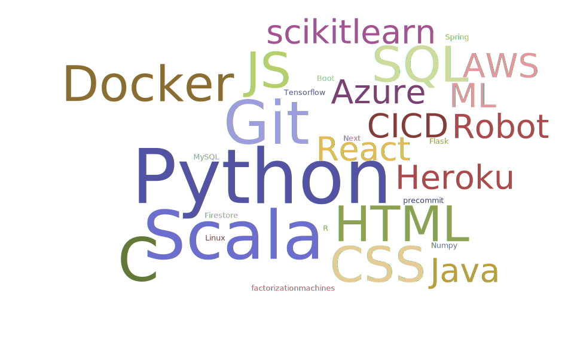

# Team 6 CV (Team Kuha)

### About Us

We are an all-round team consisting of an n-year student, few newcomers and one medical doctor to keep an eye on us. Diversity is a clear strength of our team since about half of us are already working in the industry and the other half is excited to learn as much as they can. We have multidiscplinary skills, but what unites us is a big interest in software development.
We are looking for a project that fullfills our wide interests. Fullstack and Machine Learning with a touch of neural networks are something that we would like to work with.

TLDR;
1. A lot of working experience
2. Interested in fullstack + Machine Learning = megastack

### Skills

These are some of the technologies we are familiar with:

### About Us in depth

This team consists of:
#### Development Team

– Antton, I am a full-time student and currently working part time. My freetime flows with enthusing the brain and the body. I am more than prepared to fully invest my freetime in the upcoming preject.  
  
– Sasu, also a full-time student and part-time worker. Interested in data science and planning to study both data science and bioinformatics for my Master's. I have experimented with neural networks in my free time, and built an RNN that attempts to compose music like Bach.  
  
– Samuel, I am a full-time student currently working part-time as a test automation engineer trainee at Profium. For the past two summers I worked as a software engineer trainee at Digital Living International Oy working in full-stack and backend oriented tasks.  
  
– Juho, a medical professional interested in data and bioinformatics and currently working in pharmaceuticals. Putting up a BSc thesis on Machine Learning and Tensor Factorization Machines in Predicting Preclinical Anti-Cancer Drug Combination Synergy. Implemented a regression model visualizer in CS-C2120 Programming Studio 2. A football and guitar enthusiast.  
  
– Janne, a returning student with solid (full-stack) programming skills and a bit of work experience in the software field. Interested in challenging and purposeful work.  
  
– Sami, 3rd year student, continuously learning new. Really motivated and ready to work hard for the project.  
  

#### Scrum Master
– Iiro, second-year Software and Service Engineering Master's student. Working currently as a Machine Learning engineer. Interested in IT business, digitalization, and finance.  

